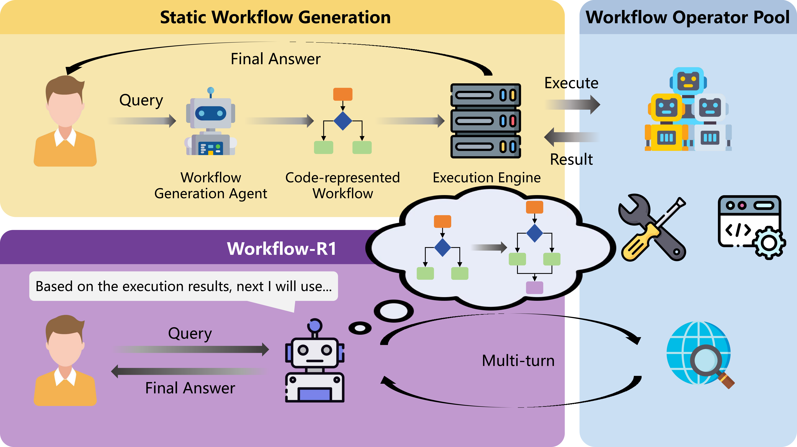
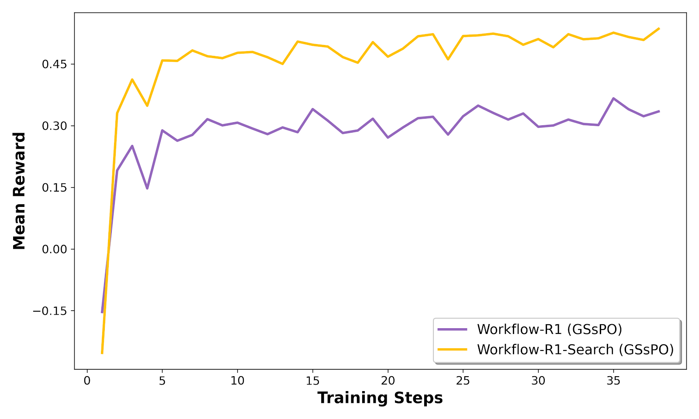
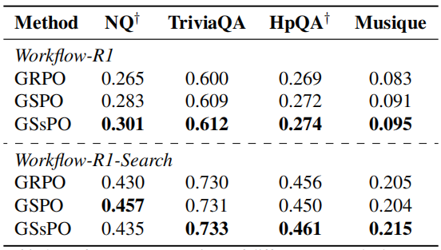

<div align='center'>
<h1>Workflow-R1: Group Sub-sequence Policy Optimization <br>for Multi-turn Workflow Construction</h1>

[](https://arxiv.org/abs/2602.01202)


</div>

## 📖 Abstract

The rapid evolution of agentic workflows has demonstrated strong performance of LLM-based agents in addressing complex reasoning tasks. However, existing workflow optimization methods typically formulate workflow synthesis as a static, one-shot code-centric generation problem. This paradigm imposes excessive constraints on the model's coding capabilities and restricts the flexibility required for dynamic problem-solving. In this paper, we present Workflow-R1, a framework that reformulates workflow construction as a multi-turn, natural language-based sequential decision-making process. To resolve the optimization granularity mismatch inherent in such multi-turn interactions, we introduce Group Sub-sequence Policy Optimization (GSsPO). While explicitly tailored to align with the interleaved Think-Action dynamics of agentic reasoning, GSsPO fundamentally functions as a structure-aware RL algorithm generalizable to a broad class of multi-turn agentic sequential decision-making tasks. By recalibrating the optimization unit to the composite sub-sequence, specifically the atomic Think-Action cycle, it aligns gradient updates with the semantic boundaries of these interactions, ensuring robust learning in complex multi-turn reasoning tasks. Through extensive experiments on multiple QA benchmarks, Workflow-R1 outperforms competitive baselines, validating GSsPO as a generalized solution for sequential reasoning and establishing Workflow-R1 as a promising new paradigm for automated workflow optimization.

## 🔥 Highlights

- **Multi-turn Workflow Construction**: Reformulates workflow synthesis from static code generation to dynamic, natural language-based sequential decision-making.
- **Group Sub-sequence Policy Optimization (GSsPO)**: A novel structure-aware RL algorithm that aligns optimization with Think-Action semantic boundaries.
- **Generalizable Framework**: GSsPO is applicable to a broad class of multi-turn agentic sequential decision-making tasks.
- **State-of-the-art Performance**: Outperforms competitive baselines on multiple QA benchmarks.

## 📰 News

📢 **[2026.02]** We open-source **Workflow-R1** and the **GSsPO** algorithm!

## ⭐ Results

<div align="center">
&nbsp;&nbsp;
</div>

GSsPO demonstrates efficient convergence and superior performance in multi-turn agentic reasoning tasks.

## 🛠️ Environment Setup

```bash
conda create -n workflow-r1 python=3.10 -y
conda activate workflow-r1

pip install torch==2.6.0 --index-url https://download.pytorch.org/whl/cu124

pip install vllm==0.8.5

pip install flash-attn --no-build-isolation

# Install verl
pip install -e .
```

## 🧪 Experiments

### Data Preparation

Construct 10,000 training samples from NQ-HotpotQA dataset:

```bash
python examples/data_preprocess/workflow_r1.py
```

### Training

Set environment variables for the operator-executing LLM, then launch training:

```bash
# Configure operator LLM endpoint
export OPERATOR_BASE_URL="your-llm-api-url"
export OPERATOR_API_KEY="your-api-key"
export OPERATOR_MODEL_NAME="your-model-name"

# Train model
bash train.sh
```

## 🙏 Acknowledgement

We sincerely thank the [verl](https://github.com/volcengine/verl) team for their outstanding open-source reinforcement learning framework and continued contributions to the community. Their dedication to building a flexible and scalable RL infrastructure has greatly benefited the research community, and we are grateful for their efforts in advancing open-source AI research.

## 📝 Citation

If you find this work useful, please cite our paper:

```bibtex
@misc{kong2026workflowr1groupsubsequencepolicy,
      title={Workflow-R1: Group Sub-sequence Policy Optimization for Multi-turn Workflow Construction}, 
      author={Mingze Kong and Zikun Qu and Zhongquan Zhou and Pengyu Liang and Xiang Li and Zhiwei Shang and Zhi Hong and Kaiyu Huang and Zhiyong Wang and Zhongxiang Dai},
      year={2026},
      eprint={2602.01202},
      archivePrefix={arXiv},
      primaryClass={cs.AI},
      url={https://arxiv.org/abs/2602.01202}, 
}
```


